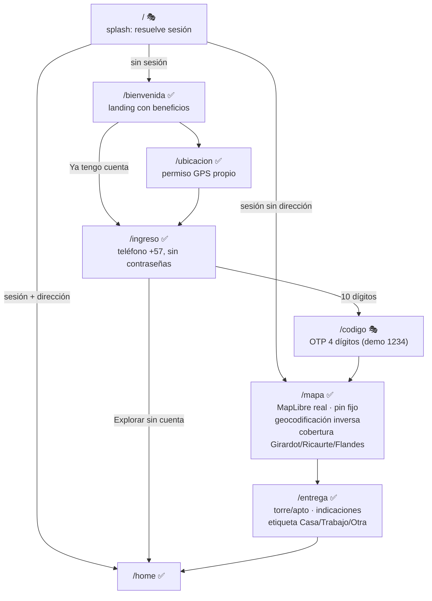
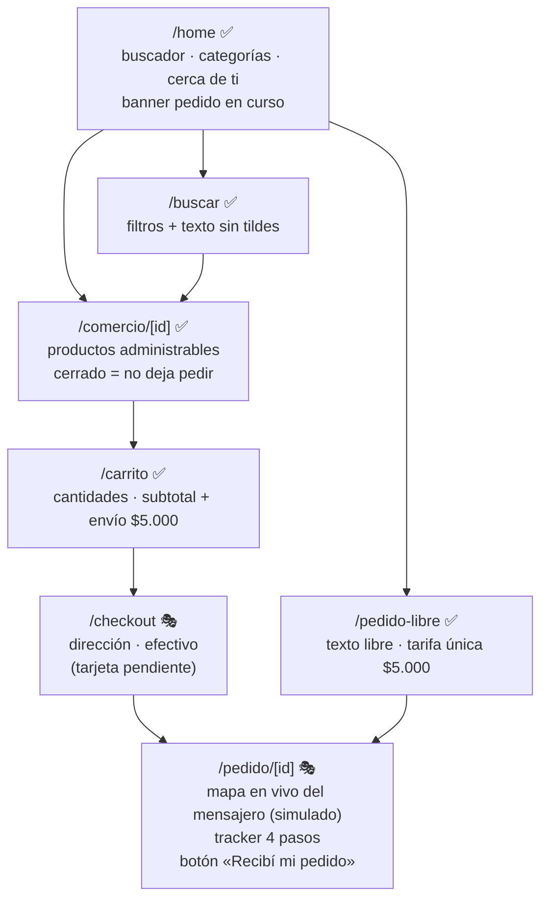
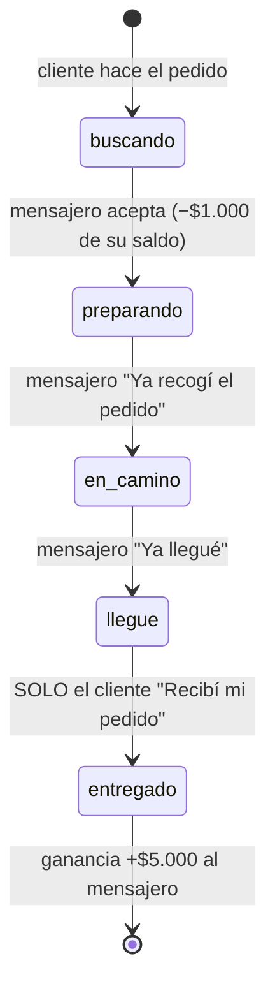
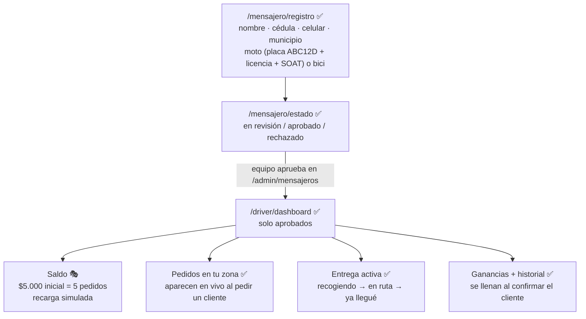
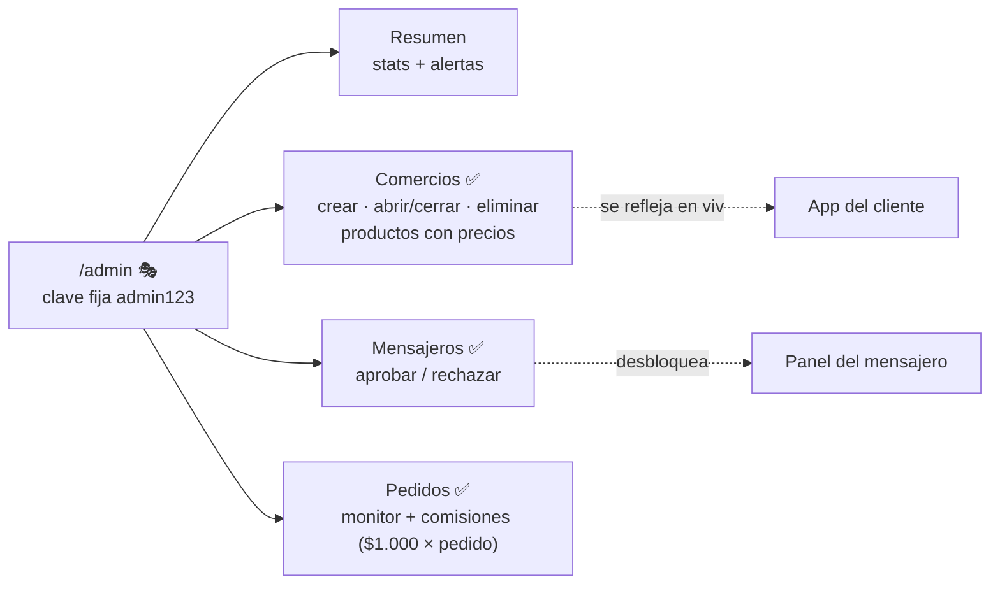

# Pídelo — Mapa de pantallas y flujos

Estado al 2026-08-05. Leyenda: ✅ funcional · 🎭 funcional con datos/servicios simulados (`TEMPORAL`) · 🕳️ pendiente.

## Los cuatro roles de la app

| Rol | Entrada | Pantallas |
|---|---|---|
| **Cliente** | `/` (splash) → `/bienvenida` → onboarding | home, buscar, comercio, carrito, checkout, seguimiento, pedido libre, pedidos, perfil |
| **Mensajero** | `/mensajero/registro` | registro, estado, panel de trabajo |
| **Equipo (admin)** | `/admin` (clave `admin123` 🎭) | resumen, comercios, mensajeros, pedidos |

---

## Flujo 1 — Onboarding del cliente

Simulado: la sesión es una cookie demo (sin Supabase Auth) y el SMS no existe — el código correcto siempre es `1234`.

## Flujo 2 — Pedir (catálogo y libre)

## Flujo 3 — El ciclo de un pedido (cliente ↔ mensajero)

Hoy sincroniza entre pestañas del mismo navegador (localStorage + eventos). Con Supabase Realtime funcionará entre teléfonos.

## Flujo 4 — Mensajero

## Flujo 5 — Admin (el que todo)

---

## Reorganización de duplicados (hecha el 2026-08-05)

- **`/` ahora es el splash** (como pide el spec): resuelve la sesión y ramifica. Usuarios nuevos ven la **landing en `/bienvenida`** (reutilizada del diseño original) cuyos botones entran al onboarding por teléfono.
- **Eliminado el login por email** (`/login`, `/register`, `/forgot-password`): había dos sistemas de autenticación; queda solo el ingreso por teléfono. El cliente de Supabase (`lib/supabase/server.ts`) se conserva para la integración real.
- **Eliminado `/customer/dashboard`** y sus componentes: superado por `/home`. Se conservan `types.ts` y `mock-comercios.ts` (semilla del almacén de comercios).

## Decisiones pendientes del equipo

1. **Supabase**: todo el estado es localStorage de un solo navegador. Es el gran siguiente paso — el esquema ya está definido por los tipos (`mensajeros`, `comercios`, `productos`, `pedidos`, `direcciones`, `saldos`).
2. **SMS real** para el OTP (Supabase Auth + Twilio) y **fotos** (documentos del mensajero, productos) con Supabase Storage.
3. **Pagos**: solo efectivo; tarjeta y la recarga real del mensajero necesitan pasarela.
4. **Seguridad real**: los candados de driver/admin son del lado del cliente; con Supabase serán roles de verdad.
5. **Modo oscuro** (el spec lo exige; el STYLE_GUIDE aún no define tokens oscuros).
6. Notificaciones push y contacto cliente ↔ mensajero (llamada/chat), no diseñados.
